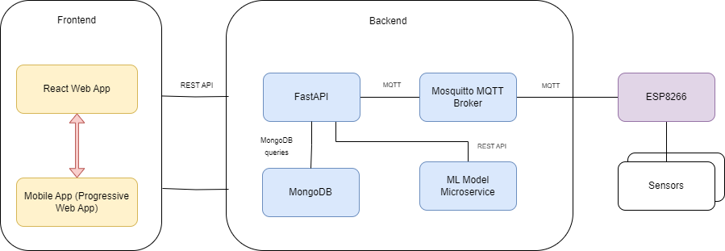

# Health Monitoring App

## Table of Contents

- [Introduction](#introduction)
- [Technologies Used](#technologies-used)
- [Supported Sensors](#supported-sensors)
- [Getting Started](#getting-started)
- [Security](#security)
- [Demo](#demo)

## Introduction

During the COVID-19 pandemic, many doctors got worried about being close to their patients. They were afraid of catching or spreading the virus. In response to this concern, our project was created to help doctors and patients connect without being in the same place.

In addition, we've incorporated a prototype of a smartwatch that collects health data from the patient. This information is then visualized in the user interface. To ensure the well-being of the user, we've set thresholds for medical data. If a user's data goes beyond these thresholds, the system sends an alert directly via email to the associated doctor. This feature enables prompt attention to any health issues that may arise.

Furthermore, users can make predictions about their heart health using their collected data, providing a convenient way to check their current health status.

For doctors, we've designed a dedicated interface where they can access and review their patients' information. This interface allows doctors to accept or decline new patients, providing a streamlined process for managing their patient load. This feature enhances the overall efficiency of healthcare delivery in the context of remote interactions.


## Technologies Used

- **React**:

  Utilized for the development of our web application and dashboards, providing a dynamic and responsive user interface.

- **PWA (Progressive Web App)**:

  Implemented as a progressive web app to enhance the mobile user experience, allowing users to access the application seamlessly on   various devices.

- **FastAPI**:

  Employed as the backend framework to power the server-side functionalities of our application, ensuring efficient and high-        performance operations.

- **MongoDB**:

  Chosen as the database solution to store and manage the application's data, providing flexibility and scalability for handling   diverse information.

- **Mosquitto Broker**:

  Integrated to facilitate communication between sensors and the backend, ensuring a reliable and secure exchange of data from the sensors to the server.



## Supported Sensors

Our application integrates with various sensors to gather essential health data. Here are the supported sensors:

### MAX30100 (Heart Rate + SpO2 Sensor)

- The MAX30100 sensor is used to measure both heart rate and blood oxygen saturation (SpO2).

### DS18B20 (Temperature Sensor)

- The DS18B20 sensor is employed to measure temperature accurately.
### MPS20N0040D (Blood Pressure Sensor)

- The MPS20N0040D sensor is utilized to measure blood pressure.
- It aids in monitoring blood pressure levels, providing crucial information for healthcare assessment.


  

## Getting Started
1. To run the backend of our application, follow these steps:

   ```bash
   git clone https://github.com/your-username/your-repo.git
   pip install -r requirements.txt
   cd backend

   uvicorn main:app --reload
   ```
2. For the frontend, kidnly follow these steps:
      ```bash
   cd tsyp
   npm i
   npm run dev 
   ```
Provide instructions on how to set up the project locally. Include details about installing dependencies and running the application.

3. Setting up MongoDB

You have two options for setting up MongoDB for our application:

#### Option 1: Local MongoDB Installation

1. **Install MongoDB:**
   - Download and install MongoDB from [MongoDB Download Center](https://www.mongodb.com/try/download/community).
   - Follow the installation instructions for your operating system.

2. **Create Database and Collections:**
   - Open a terminal or command prompt.
   - Run MongoDB by executing the `mongod` command.
   - In a separate terminal, connect to the MongoDB server using the `mongo` command.
   - Create the "HealthData" database and the required collections:
     ```bash
     use HealthData
     db.createCollection("Users")
     db.createCollection("Doctors")
     ```

### Option 2: Using Docker

1. **Install Docker:**
   - Download and install Docker from [Docker Desktop](https://www.docker.com/products/docker-desktop).

2. **Run Docker Compose:**
   - Navigate to the root directory of the project.
   - Run the following command to start MongoDB using Docker Compose:
     ```bash
     docker-compose up
     ```
   - This command will pull the MongoDB image and start a container with the necessary configurations.

### Security 

To ensure the security of our application and protect sensitive data, we employ robust encryption measures before transmitting any information. The majority of our communications are conducted using the secure shell (SSH) protocol, adding an extra layer of protection against unauthorized access. Additionally, for local development purposes, we utilize mkcert to implement Transport Layer Security (TLS) on localhost. 


### Demo 

[Click here to watch the video](https://drive.google.com/drive/folders/1xW1XTwPF-ujhIRcMsu30sQzZztjd_cZP?usp=sharing)


